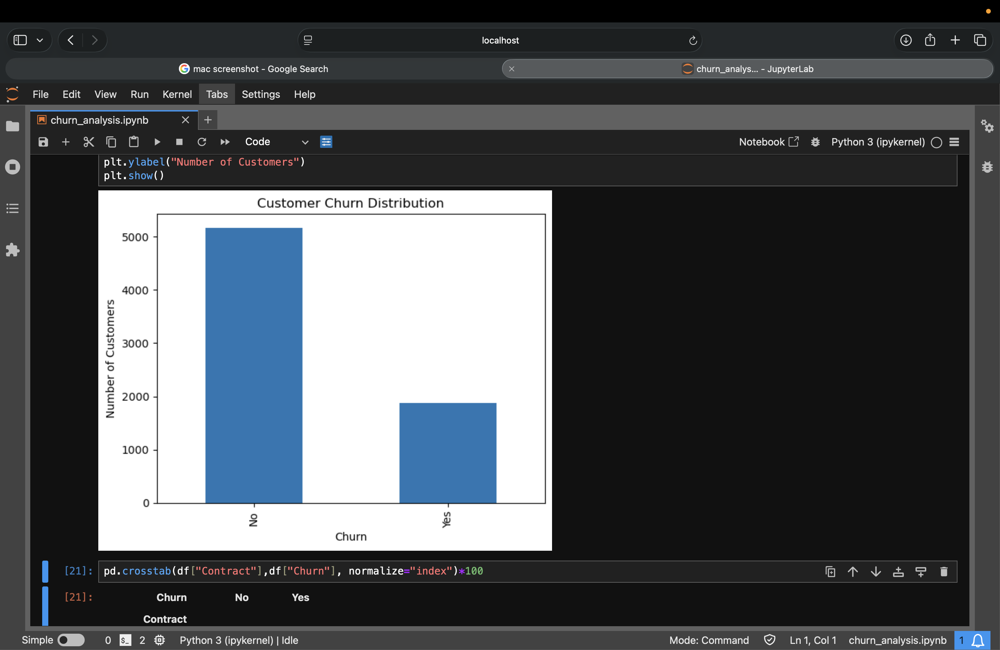

## Project Visualization

Customer Churn Analysis using Python

Project Overview

This project analyzes customer churn data from a telecom company using Python and Pandas.

The objective was to identify the key factors driving customer attrition and develop business recommendations to improve customer retention.

Dataset

- 7,043 customer records
- Customer demographics
- Contract information
- Billing information
- Service usage
- Churn status

Tools Used

- Python
- Pandas
- Matplotlib

Key Findings

Overall Churn Rate

- 26.5% of customers churned

Contract Type

- Month-to-Month customers: 42.7% churn
- One-Year customers: 11.3% churn
- Two-Year customers: 2.8% churn

Tech Support

- Customers without tech support showed significantly higher churn rates.

Payment Method

- Electronic Check users had the highest churn rate at 45.3%.

Monthly Charges

- Customers who churned paid higher monthly charges on average.

Customer Tenure

- Customers who churned stayed for approximately 18 months on average.
- Retained customers stayed for approximately 38 months.

Business Recommendations

- Promote longer-term contracts.
- Increase adoption of tech support services.
- Encourage automatic payment methods.
- Focus retention efforts on customers in their first 18 months.
- Investigate high churn among fiber-optic customers.

Author

Ashish Sharma
